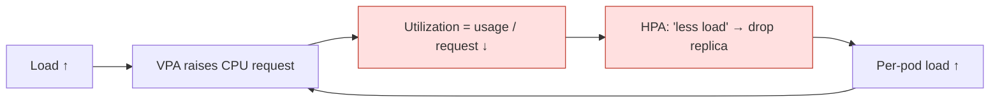
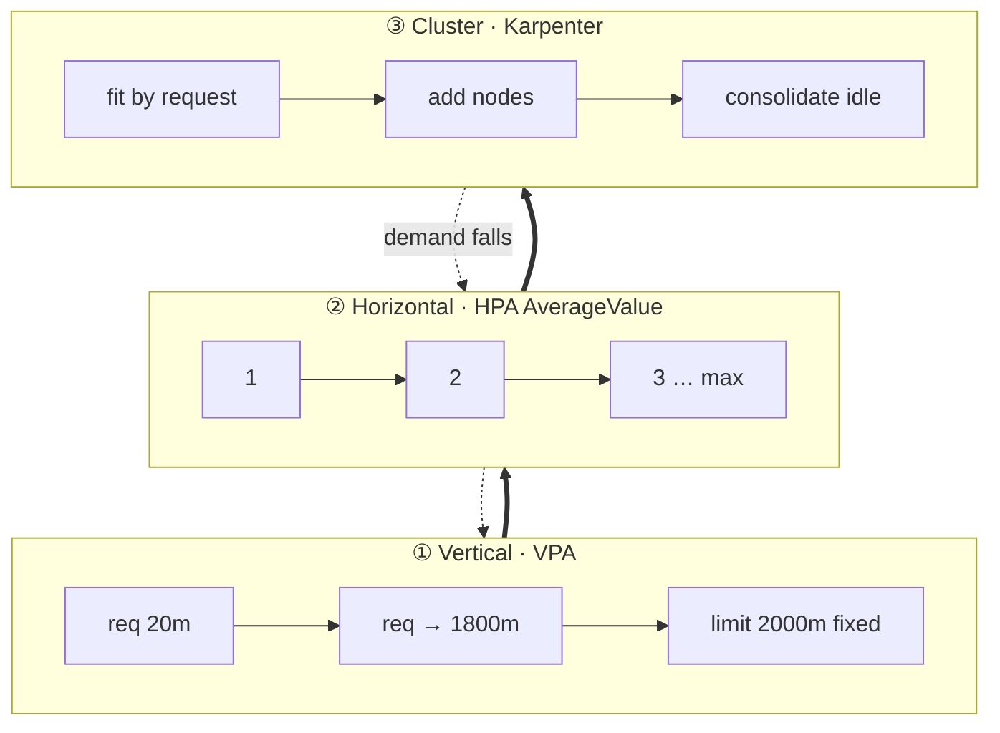
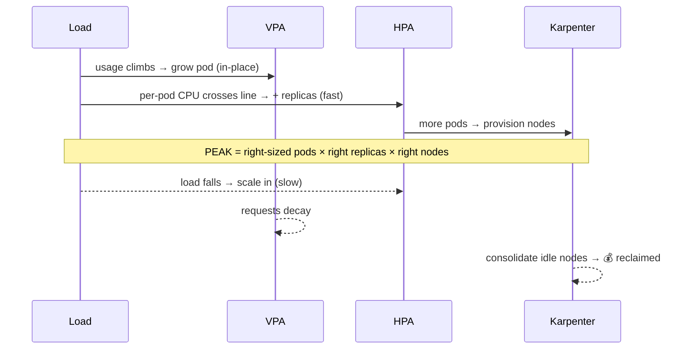
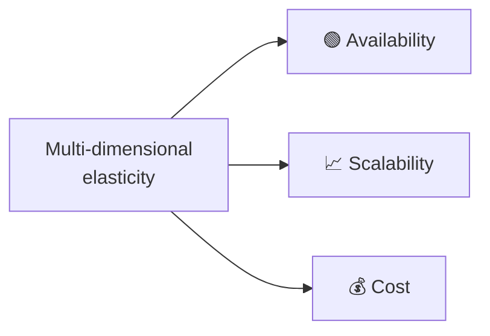

<!-- _class: lead -->
# Grow Up, Then Out
## Safe Multi‑Dimensional Autoscaling on Kubernetes
### VPA × HPA × Karpenter — working **together**, not fighting

 

**Merih İlgör** · Platform Engineering · 2026

---

## The autoscaling you're told not to mix

| Axis | Tool | Great at | Blind to |
|---|---|---|---|
| **Vertical** — pod size | **VPA** | right‑sizing requests | volume spikes |
| **Horizontal** — replicas | **HPA** | absorbing traffic | mis‑sized pods |
| **Cluster** — nodes | **Karpenter** | capacity + cost | anything app‑level |

> Use one axis → you leave **cost** *and* **resilience** on the table.
> Combine HPA + VPA naïvely → they **oscillate**. So everyone picks one. ❌

---

## Why naïve HPA + VPA fights

`Utilization` is **relative to the request** — so when VPA moves the request, HPA is reading a moving ruler.

---

<!-- _class: lead -->
# The idea
Grow each pod **vertically** to a fixed ceiling first — then scale **horizontally** — on a node fleet that follows demand.

HPA reads **absolute** CPU, so a VPA resize never looks like "less load."

---

## Three layers, one cooperative system

Grow **up** → grow **out** → fleet follows. Reverse on the way down.

---

## The one rule that makes it safe — *the guard*

No workload may have VPA‑on‑CPU **and** HPA `Utilization` at once.

- HPA CPU metric → **`type: AverageValue`** (absolute milli‑cores), never `Utilization`
- `averageValue = 0.5 × maxAllowed.cpu` → scale out after vertical headroom is used
- If an HPA *can't* be `AverageValue` → make that VPA **memory‑only**

✅ Oscillation removed **by construction**, not by luck.

---

## How it behaves over a demand cycle

**Grow fast, shrink slow.**

---

## Safe by configuration (reference values)

| Component | Key setting |
|---|---|
| **HPA** | CPU `AverageValue`, `averageValue = 0.5×maxAllowed.cpu` |
| **VPA** | `InPlaceOrRecreate`, `maxAllowed = 0.9×limit`, limits fixed |
| **Recommender** | `--round-memory-bytes`, tuned histogram decay |
| **Updater** | `feature-gates=InPlaceOrRecreate=true`, lifetime threshold |
| **Karpenter** | `consolidateAfter` dev 10–15m · prod 2h |
| **PDB** | upper envs: `maxUnavailable:1` + `minReplicas≥2` |

---

## Every objection has a configured answer

| Risk | Neutralised by |
|---|---|
| HPA↔VPA oscillation | `AverageValue` (the guard) |
| VPA balloons limits | `RequestsOnly` + fixed limit + `0.9×limit` cap |
| Node thrash | `consolidateAfter` tuning (1m→10m: **48→25** disruptions) |
| Availability on scale‑in | `maxUnavailable:1` PDB + `minReplicas≥2` |
| PDB blocking scale‑down | `maxUnavailable:1`, never `minAvailable:1` |
| OOM / under‑provision | memory `minAllowed` floor, slower mem decay |

---

## One mechanism — three wins

- **Availability** — right‑sized pods + replicas + PDBs → resilient through change
- **Scalability** — scales on per‑pod load **and** request volume **and** node capacity
- **Cost** — no static over‑provisioning; idle nodes consolidated away

---

## Proven on live EKS + Karpenter

| Signal | Result |
|---|---|
| HPA↔VPA conflict | **None** — replicas monotonic, no flapping |
| Availability @ peak load | **99.4 %** (100 % idle/normal) |
| Consolidation churn | **48 → 25** disruptions; node thrash eliminated |
| Idle node footprint | ~**halved** (7 → ~4) |
| Ordering | VPA grew pods **first**, HPA added replicas **after** |

Real CPU load, full idle→peak→idle cycle, continuous monitoring.

---

## Operating model

- 🧩 **GitOps‑native** — everything is manifests reconciled by ArgoCD
- 🌍 **Per‑environment policy** — dev = cost (1 replica, no PDB, fast consolidation); upper = availability (`≥2`, PDB, 2h)
- ♻️ **Repeatable** — an enablement agent discovers each project's services (kustomize *or* raw), classifies app vs infra, applies + validates + ships

---

<!-- _class: lead -->
# Takeaway
"Never combine HPA + VPA" was really "never use `Utilization` with VPA‑on‑CPU."

Fix that one decision → **three autoscalers cooperate**: more available, more scalable, measurably cheaper.

---

<!-- _class: lead -->
# Thank you

**Grow Up, Then Out** — Multi‑Dimensional Autoscaling

**Merih İlgör** · Platform Engineering

*Full whitepaper: `whitepaper-multidimensional-autoscaling.md`*
