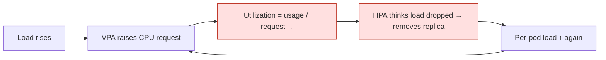
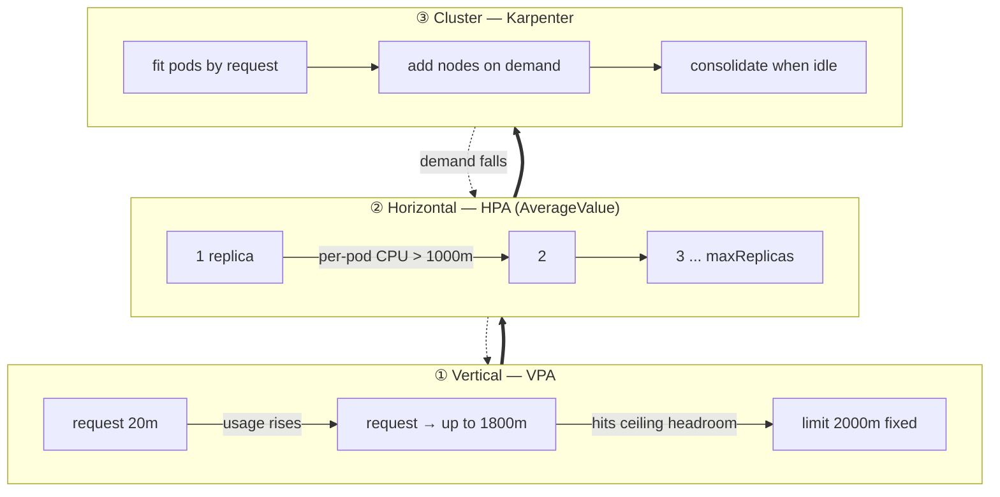
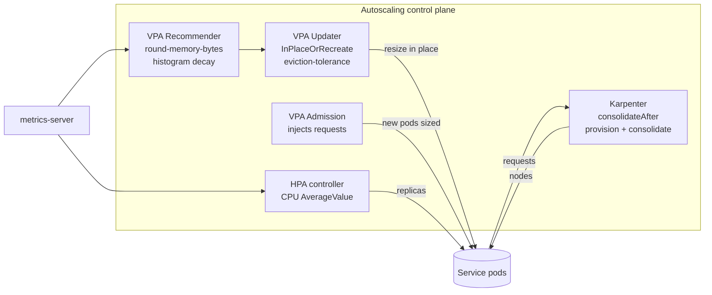
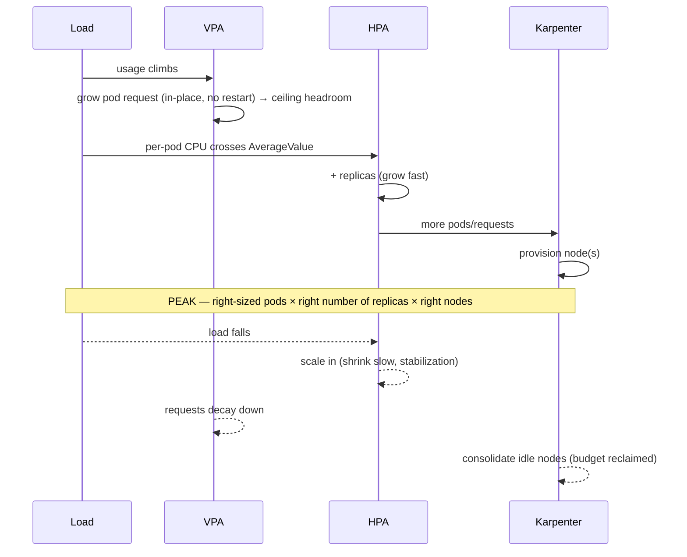
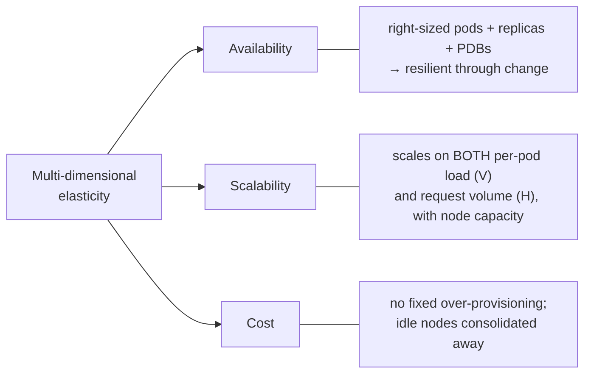

# Grow Up, Then Out: Safe Multi‑Dimensional Autoscaling on Kubernetes

### Combining VPA (vertical), HPA (horizontal) and Karpenter (cluster) into one cooperative system

**Author:** Merih İlgör
**Version:** 1.0 · **Date:** 2026‑06‑25
**Audience:** Platform / SRE / FinOps engineers running EKS with Karpenter

---

## Executive summary

Kubernetes ships three autoscalers that most teams are told **never** to combine: the Vertical Pod
Autoscaler (VPA) resizes a pod, the Horizontal Pod Autoscaler (HPA) adds replicas, and a node
autoscaler (Karpenter) adds/removes machines. Run naïvely, VPA and HPA **fight** over CPU and
oscillate, so the common advice is "pick one axis."

This paper presents a **cooperative, multi‑dimensional** design that makes all three work together
safely, summarised in one sentence:

> **Grow each pod vertically up to a fixed safety ceiling first; then scale out horizontally; and let
> Karpenter move the node fleet underneath — with HPA reading *absolute* CPU so a VPA resize never
> looks like "less load."**

The result: workloads are **right‑sized continuously** (cost), absorb per‑pod load **and** request‑volume
spikes (scalability on two axes), and stay available through change (resilience) — validated on a live
EKS/Karpenter cluster with **99.4 % availability under peak load** and **~half the node footprint at idle**.

---

## 1. The problem: single‑axis autoscaling leaves money and resilience on the table

| Axis | Tool | Good at | Blind to |
|---|---|---|---|
| **Vertical** (pod size) | VPA | right‑sizing requests to real usage | request‑volume spikes (one pod can only get so big) |
| **Horizontal** (replicas) | HPA | absorbing traffic volume | wrongly‑sized pods (over/under‑provisioned requests) |
| **Cluster** (nodes) | Karpenter | capacity + bin‑packing + cost | nothing app‑level; only reacts to pod *requests* |

Pick only HPA → you over‑provision every replica. Pick only VPA → you can't scale past one big pod.
Combine them naïvely → **oscillation**: VPA raises the CPU request, `Utilization = usage/request`
drops, HPA concludes "less load" and removes a replica, load per pod rises, VPA grows again… a fight.

*Figure 1 — Why HPA(`Utilization`) + VPA(cpu) oscillate.*

---

## 2. The approach: vertical‑first, then horizontal, on a moving node fleet

Three ideas, layered:

1. **Vertical first, to a static ceiling.** Limits are fixed platform policy (e.g. `cpu 2000m /
   mem 2000Mi`). VPA moves only the *request* (the scheduling signal) up to `maxAllowed = 0.9 × limit`
   — so a pod grows into its own headroom before anything else happens, and the limit stays a hard
   safety ceiling VPA can never cross.
2. **Then horizontal, on absolute CPU.** The HPA scales on **`type: AverageValue`** (absolute
   milli‑cores per pod), **not** `Utilization`. Because the trigger is independent of the request,
   VPA growing the request **cannot** distort HPA's signal — the oscillation is removed *by
   construction*. A replica is added only once a pod's real usage crosses an absolute line
   (`averageValue = 0.5 × maxAllowed.cpu`), i.e. after vertical headroom is in play.
3. **Karpenter moves the fleet.** More replicas + larger requests raise aggregate demand; Karpenter
   adds nodes to fit and **consolidates** them away when demand falls — turning the app‑level
   elasticity into a real **cost** lever.

*Figure 2 — Grow up (VPA), then out (HPA), then the fleet follows (Karpenter); and the reverse on the way down.*

### The non‑negotiable invariant (the "guard")
> A workload may **never** have *VPA controlling CPU* **and** *HPA CPU target `Utilization`* at the same
> time. If an HPA can't be `AverageValue`, the VPA is made **memory‑only** for that workload. This single
> rule is what makes the combination safe.

---

## 3. Architecture & control loops

*Figure 3 — Recommender→Updater right‑sizes pods; HPA sets replicas on absolute CPU; Karpenter sizes the fleet from pod requests.*

---

## 4. The lifecycle over a demand cycle

*Figure 4 — "Grow fast, shrink slow": fast vertical+horizontal response up; conservative, cost‑reclaiming wind‑down.*

---

## 5. The configuration that makes it safe (reference values)

| Component | Setting | Reference value | Why |
|---|---|---|---|
| **HPA** | CPU metric type | `AverageValue` (not `Utilization`) | removes oscillation by construction |
| | `averageValue` | `0.5 × maxAllowed.cpu` | scale out at half the max a pod may grow to |
| | `min/maxReplicas` | dev `1..3`; upper `≥2..N` | replica band |
| **VPA** | `updateMode` | `InPlaceOrRecreate` | resize live pods, ~0 restarts (K8s ≥1.33) |
| | `controlledValues` | `RequestsOnly` (default) / `RequestsAndLimits` | move the request; keep limits as a fixed ceiling |
| | `maxAllowed` / `minAllowed` | `0.9 × limit` / sane floor | headroom under the hard limit; avoid starving |
| **Recommender** | `--round-memory-bytes` | on | human‑readable `Mi/Gi` recommendations |
| | cpu/mem histogram decay | shortened in dev | responsiveness to recent load |
| **Updater** | `--feature-gates=InPlaceOrRecreate=true` | on | enables in‑place resize |
| | `--in-recommendation-bounds-eviction-lifetime-threshold` | dev short / prod long | "shrink slow" knob (valid flag — *not* `pod-lifetime-update-threshold`) |
| **Karpenter** | `consolidateAfter` | dev `10–15m`, prod `2h` | reclaim idle nodes without thrash |
| **PDB** | upper envs only | `maxUnavailable: 1` + `minReplicas ≥ 2` | protect availability *without blocking* consolidation |

---

## 6. Risks — and how each is neutralised

| Risk (the reason people avoid this) | Neutralised by |
|---|---|
| **HPA↔VPA oscillation on CPU** | HPA on `AverageValue` (absolute) — the guard invariant |
| **VPA over‑provisions limits** (`RequestsAndLimits` balloons limits proportionally) | default `RequestsOnly`; fixed limit ceiling; `maxAllowed = 0.9×limit` |
| **Node thrash / pod churn** from aggressive consolidation | tune `consolidateAfter` (1m → 10m halved disruptions, removed node thrash) |
| **Availability hit during scale‑in / consolidation** | `maxUnavailable:1` PDB + `minReplicas≥2` in upper envs (keeps ≥1 serving) |
| **PDB blocking scale‑down** | use `maxUnavailable:1`, never `minAvailable:1` on single‑replica |
| **Memory under‑provision / OOM** | memory `minAllowed` floors; longer memory histogram decay than CPU |
| **Pod‑IP exhaustion at high density** | prefix delegation only with `/28`‑capable subnets + `maxPods` |

The headline: every classic objection has a concrete, configured answer — the combination is **safe by
configuration, not by luck**.

---

## 7. Benefits

*Figure 5 — One mechanism, three wins.*

- **Availability (multi‑dimensional resilience).** Pods are sized to real demand, replicas absorb
  volume, PDBs protect during disruption. Measured **99.4 % availability under peak load** (100 % at
  idle/normal) in validation.
- **Scalability on two axes simultaneously.** Vertical handles a heavier *individual* request; horizontal
  handles *more* requests; Karpenter guarantees the capacity exists — no single ceiling.
- **Cost‑effectiveness.** VPA removes static over‑provisioning (requests follow usage); HPA adds replicas
  *only* when truly needed; Karpenter **consolidates idle capacity** — validation showed the idle node
  footprint shrink to roughly **half** of the pre‑optimisation baseline, with a clean overnight
  scale‑to‑zero path for non‑prod.
- **Operationally clean.** Entirely GitOps‑managed, per‑environment policy (dev vs upper), and packaged as
  a reusable enablement agent so any project can adopt it consistently.

---

## 8. Evidence (live EKS + Karpenter validation)

Real CPU load was injected into live services across an idle → normal → peak → ramp‑down cycle while
node/pod counts, HPA/VPA state and availability were recorded continuously.

| Signal | Result |
|---|---|
| HPA↔VPA conflict | **None** — replica counts monotonic; VPA grew requests with no replica flapping |
| Availability (peak load) | **99.4 %** (100 % idle/normal) |
| Karpenter consolidation churn | **48 → 25** disruptions after tuning `consolidateAfter` 1m→10m; node thrash eliminated |
| Idle node footprint | consolidated to ~**4** nodes vs an over‑provisioned baseline of 7 |
| Vertical→horizontal ordering | observed: VPA grew the pod first; HPA added replicas only after per‑pod CPU crossed the line |

The one residual gap — a brief dip during *single‑replica* ramp‑down — is closed in upper environments
with `minReplicas ≥ 2` + the PDB, a deliberate availability‑vs‑budget choice per environment.

---

## 9. Operating model

- **GitOps‑native:** all changes are manifests reconciled by ArgoCD; nothing imperative.
- **Per‑environment policy:** dev favours cost (single replica, no PDB, fast consolidation); upper
  environments favour availability (`minReplicas≥2`, PDB, conservative consolidation 2h).
- **Repeatable:** an enablement agent discovers each project's services (kustomize *or* raw), classifies
  app‑services vs infra, applies the VPA/HPA/PDB changes, validates, and ships via GitOps.

---

## 10. Conclusion

The "never combine HPA and VPA" rule is a symptom of *one* missing decision — using `AverageValue`
instead of `Utilization`. Make that single change, add the supporting VPA/Karpenter configuration, and
the three autoscalers stop competing and start cooperating: **grow up, then out, on a fleet that follows
demand.** The payoff is elasticity in three dimensions at once — more available, more scalable, and
measurably cheaper.

---

*Prepared and signed by*

**Merih İlgör**
*Platform Engineering*
2026‑06‑25
